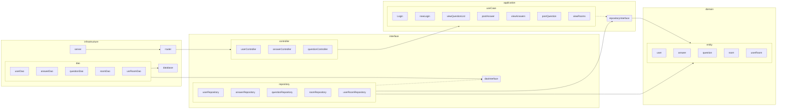

```mermaid
flowchart LR
server --> router
router --> controller
controller --> useCase
repository --> entity
repository --> repositoryInterface
repositoryInterface --> entity
useCase -.-> repositoryInterface
repository -.-> daoInterface
dao --> daoInterface
dao --> database
subgraph infrastructure
server
router
database
subgraph dao
userDao
answerDao
questionDao
roomDao
usrRoomDao
end
end

subgraph interface
subgraph controller
userController
answerController
questionController
end
subgraph repository
userRepository
answerRepository
questionRepository
roomRepository
userRoomRepository
end
subgraph daoInterface

end
end

subgraph application
subgraph useCase
Login
newLogin
viewQuestionList
postAnswer
viewAnswers
postQuestion
viewRooms
end
subgraph repositoryInterface
end
end

subgraph domain
subgraph entity
user
answer
question
room
userRoom
end
end
```
